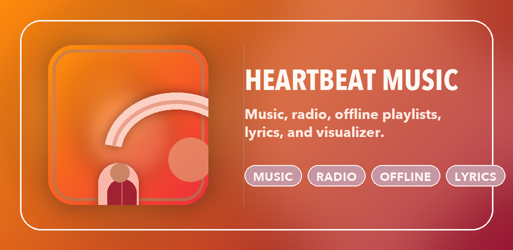

# Heartbeat Music

  

## App Overview

App name: Heartbeat Music

Short description: Stream music, radio, ambient sounds, and offline playlists in one app.

## Full Description

Heartbeat Music brings together online songs, internet radio, relaxing sound collections, and your own offline library in one easy player.

Discover music by language, artist, album, genre, or year. Search tracks quickly, open song links, share favorites, and view lyrics when available. Save songs, radio stations, and sound playlists to your personal offline collection so you can listen again without starting from zero.

Import songs from your device or an entire folder, organize content into playlists, and back up your library with JSON export and import tools. Heartbeat Music also includes a full player with playlist queue support, loop controls, audio mixer options, and a visualizer mode for a more immersive listening experience.

Whether you want online discovery, radio streaming, relaxing background audio, or your own saved playlists, Heartbeat Music keeps everything in one place.
